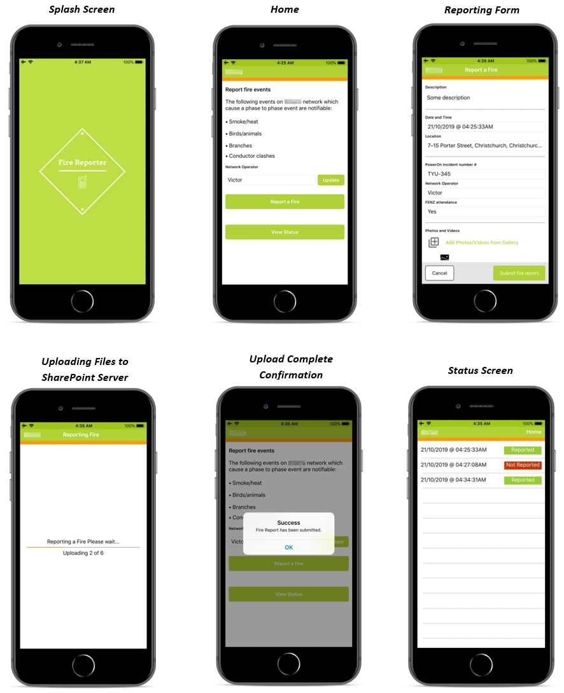
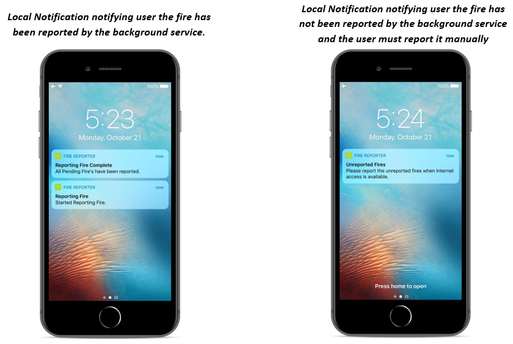

# FireReporter

Fire Reporter is developed as a cross-platform application for IOS and Android for an energy company in New Zealand. The main aim of this application is to assist lineman of the energy company to reports fire’s caused by electrical faults in rural areas. The technology stack includes Xamarin.Forms for developing the cross-platform mobile app for IOS and Android, SharePoint API to upload files in the tenant’s SharePoint directory on a remote server Microsoft Graph API for SharePoint authentication.

It’s a simple application which includes a form that allows the user to input event data such as event description, Date and Time, location (auto captured based on user’s location) and attachment of media files from their gallery. Once the user has filled in the required details the user can submit the report. After the report has been submitted, the key component of this app that checks for network connectivity plays a significant role.

One of the most important requirements from the stakeholders is, the app should have offline support as this app will be used in rural areas which are prone to loss of connectivity. Regardless of the phone’s connectivity status, the user should be able to submit a form when a fire event is recorded. The functionality of this app is driven by two use cases.

The first use case is when the network connectivity is available, at this stage it’s a simple scenario, the user submits the form via the app. The app confirms network connectivity, start’s uploading files to the remote SharePoint server and upon completion, sends an email to the authorised personnel with information recorded via the form which also includes a link to the uploaded media files for the SharePoint server. This process is exibited by following screen shots of the application:

### When Network is connected both on Android and IOS:

### Offline Support on Android:
When the there is no network access:
* The Report Data is stored in the local Database
* A “Foreground service” is started which monitors the connectivity.
* As the Connectivity changes from not connected to connected, the foreground service responds to the event and starts sending the pending reports.
* Once all the reports are reported the service is terminated.

### Offline Support on Android:
When the there is no network access:
* The Report Data is stored in the local Database
* A “Background service” is started which monitors the connectivity.
* As the Connectivity changes from not connected to connected, the Background service responds to the event and starts sending the pending reports.
* Once all the reports are reported the service is terminated.

However, IOS implements strict rules on background service, therefore a background service has limited time to execute. When the time allocated to the background service is over, the service is terminated by the IOS.

Due to the above-mentioned limitations, automation for the reporting offline fire report is limited and manual assistance is required.

When the background service is about to be terminated, the background service notifies the user via local notifications, the fire has not been reported during the allocated time and the user must manually report the fire when there is network access.

